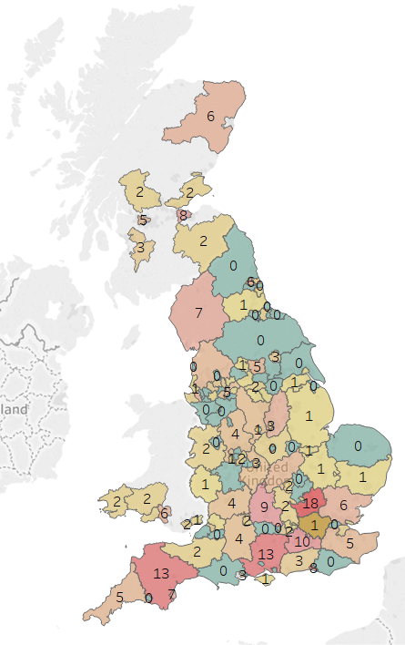
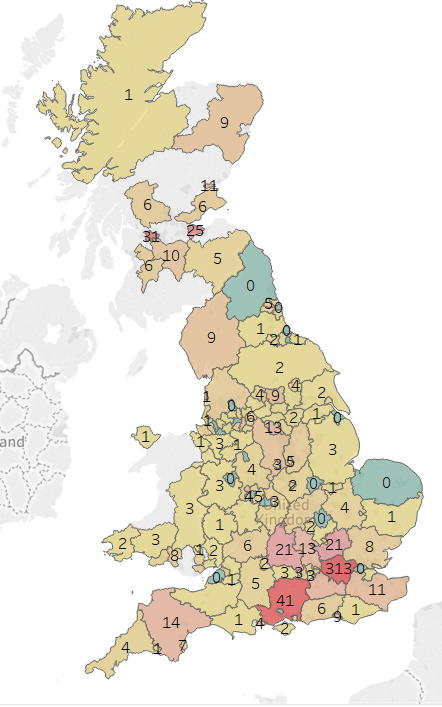
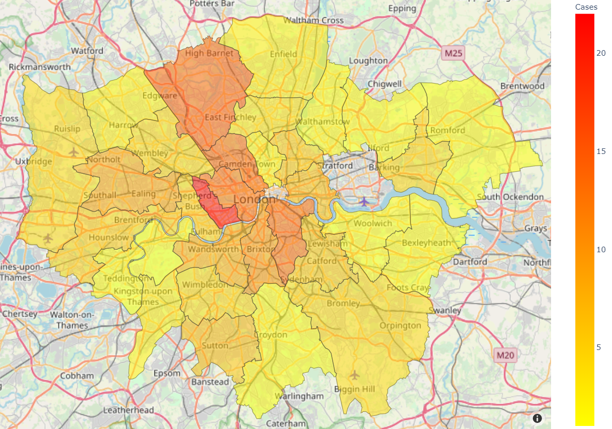
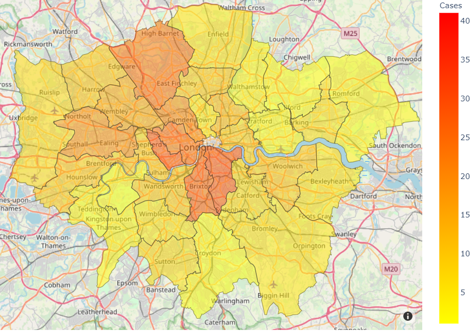

# Coronavirus Map

A virus with wanderlust

## Problem

With the UK government moving from the "containment" to the "delay" phase of its response to the Covid-19 outbreak, and the University doubling it's number of confirmed cases overnight, it is time we took the Coronavirus situation more seriously. More importantly, I want to travel in the upcoming Easter vacations and need a better way of deciding which travel destinations are safe.

All geographic visualisations currently avaliable only show the numbers per country which is not very helpful for making decisions about travel destinations within a country such as the UK. In order to make a more informed decision about travel destinations which in turns minimises the risk of infection of the traveller and hence the traveller's close contacts, a more detailed breakdown of the situation in each local district is required.

Current data are presented in the form of numbers - a visualisation of the density of cases is more representative than simply the number of cases.

Some frontend is also required to allow the visualisations to be easily accessible to the masses.

## Datasets used

**England data:**
1. https://www.gov.uk/government/publications/coronavirus-covid-19-number-of-cases-in-england/coronavirus-covid-19-number-of-cases-in-england , CAA 11/03/2020 (data provider discontinued)
2. https://www.gov.uk/government/publications/covid-19-track-coronavirus-cases , CAA 14/03/2020

**Scotland data:**

1. https://www.gov.scot/coronavirus-covid-19/ , CAA 14/3/20

**Wales data:**

1. https://www.walesonline.co.uk/news/wales-news/coronavirus-covid-19-advice-guidance-17901655 , CAA 11/3/20
2. https://www.bbc.co.uk/news/uk-wales-51856495 , CAA 12/3/20
3. https://phw.nhs.wales/news/public-health-wales-statement-on-novel-coronavirus-outbreak/ , CAA 13/3/20

## Current Result

Interactive website [here](https://terenceneo.github.io/Data-Visualisations/VirusinUK.html)

UK Situation at 11/03/20:            | UK Situation at 14/03/20
:--------------------------------:|:--------------------------------:
| 

**London Situation at 13/03/20**

**London Situation at 14/04/20**

## Extra Features

- Included a more detailed breakdown for London which is not only the epicenter of the outbreak in the UK, but also a major transportation hub.

## Improvements in Progress

- Automate data collection: either data retrieval from URL or periodic scraping off website
