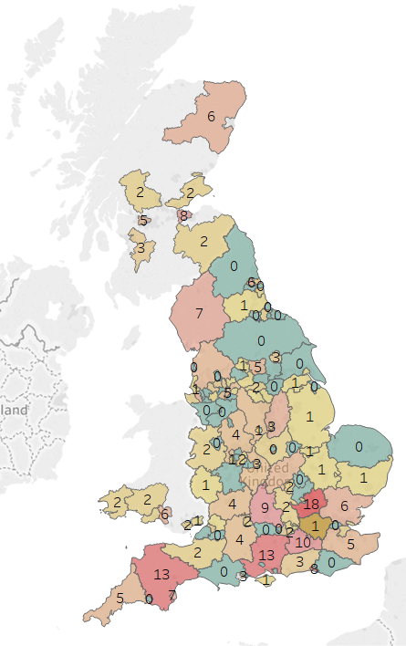

# Coronavirus Map

## Datasets used

**England data:**
1. https://www.gov.uk/government/publications/coronavirus-covid-19-number-of-cases-in-england/coronavirus-covid-19-number-of-cases-in-england , CAA 11/03/2020
2. https://www.gov.uk/government/publications/covid-19-track-coronavirus-cases , CAA 11/03/2020

**Scotland data:**

https://www.gov.scot/coronavirus-covid-19/ , CAA 11/3/20

**Wales data:**

https://www.walesonline.co.uk/news/wales-news/coronavirus-covid-19-advice-guidance-17901655 , CAA 11/3/20

## Current Result

Interactive website [here](https://terenceneo.github.io/Data-Visualisations/VirusinUK.html)

## Improvements in Progress

- Cumulate London cases and create another map for detailed breakdown of London
- Include data for wales from [BBC news article](https://www.bbc.co.uk/news/uk-wales-51856495)
