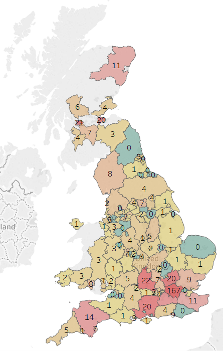

# Coronavirus Map

## Datasets used

**England data:**
1. https://www.gov.uk/government/publications/coronavirus-covid-19-number-of-cases-in-england/coronavirus-covid-19-number-of-cases-in-england , CAA 11/03/2020 (data provider discontinued)
2. https://www.gov.uk/government/publications/covid-19-track-coronavirus-cases , CAA 13/03/2020

**Scotland data:**

1. https://www.gov.scot/coronavirus-covid-19/ , CAA 13/3/20

**Wales data:**

1. https://www.walesonline.co.uk/news/wales-news/coronavirus-covid-19-advice-guidance-17901655 , CAA 11/3/20
2. https://www.bbc.co.uk/news/uk-wales-51856495 , CAA 12/3/20

3. https://phw.nhs.wales/news/public-health-wales-statement-on-novel-coronavirus-outbreak/ , CAA 13/3/20

## Current Result

Interactive website [here](https://terenceneo.github.io/Data-Visualisations/VirusinUK.html)

Situation at 11/03/20:            | Situation at 13/03/20
:--------------------------------:|:-------------------------:
 | 

## Improvements in Progress
